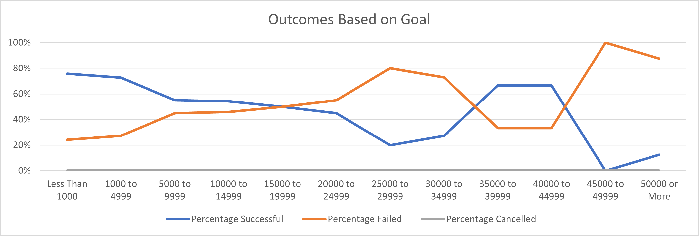

# Kickstarting with Excel

**Overview of Project**
Louise's play, Fever, almost met its fundraising goal in a short amount of time. Curious to know how theater campaigns performed in relation to their launch dates
and fundraising goals, I used Excel to show this relationship.

**Purpose**
The purpose of the project is to find out if there is a relationship between how plays performed and their launch dates and fundraising goals. 

# **Analysis and Challenges**

## Analysis of Outcomes Based on Launch Date
In this analysis, I took a look at the outcomes of campaigns based on their launch date. The analysis looks at specifically Theater campaigns and their outcomes by month across all the years. The graph below shows a monthly trend by outcome (cancelled, failed and successful). 

### Challenges and Difficulties Encountered
The most difficult part of this analysis was something tactical, which was getting the launch date to only show up as the month. When I pulled the Date Created Conversion column into the rows field of the pivot table, it was still showing the Unixtime code instead of a date format. I overcame this challenge by changing the value format of the Date Created Conversion column from General to a Date format type. 

## Analysis of Outcomes Based on Goals
In this analysis I took a look at campaign performance against their funding goal. I grouped the fundraising goals by $5K increments with $1000 and below as the lowest bound and $50K and above as the highest bound. With these funding goals groupings, I made a counter to count the play campaigns that fall into their corresponding bucket. ThenI derived their percent of totals by performance outcomes for each of the funding goal bucket. The graph below shows a line chart of the funding goal groupings by their success, fail and cancel rates. 

### Challenges and Difficulties Encountered
The challenge I faced doing this analysis was using the countifs() function. This function requires you to reference all of necessary fields and values in order to to get the accurate count. I thought it was difficult to keep consistent with referencing all the fields (i.e. values of the outcome, counting only for play campaigns). I overcame this challenge by creating and using a reference field in the Outcomes Based on Goals field, which has the values I was constantly referring to. In Rows A and B (currently hidden), I have added the values - play, successful, failed and canceled, which were the constant values I was looking up to get the correct count.

## **Results**

What are two conclusions you can draw about the Outcomes based on Launch Date?
1. May through August is the peak season for theater campaign launches with more campaign launches than any other months in the year. May through August are also the months with the most successful theater campaign launches.
2. There is an increase in failed theater campaign launches in the month of October, which is curious because October is also when there are no campaign launch cancellations.

What can you conclude about the Outcomes based on Goals?
1. Plays that have a goal of less than $15K or a range between $35k to $45K have a higher success rate than plays outside that range. It is also important to note that 92% of all the plays had a goal of less than $15K and of those plays, 69% had a successful outcome.

What are some limitations of this dataset?
I think the dataset could have given us more insight if there was a field to show the genre of the campaigns. I would be curious to see audience behavior on genres, i.e. whether they're more inclined to pledge for a specific genre. In addition, I think it would be helpful to see other factors that might have contributed to the campaigns' performance and more specifically the channels of where they were advertised. 

What are some other possible tables and/or graphs that we could create?

I think think labeling the graphs would make the graphs easier to understand. This means having to add axis titles to give the audience context as to what they were looking at, and adding data labels on the charts. 

For the Outcomes Based on Goal analysis, I think we can create a Box and Whisker chart by outcomes. This will let us know by outcome (successful, failed, cancelled), what the average funding goals was, upper bound and lower bound and give us insight of outliers. 
