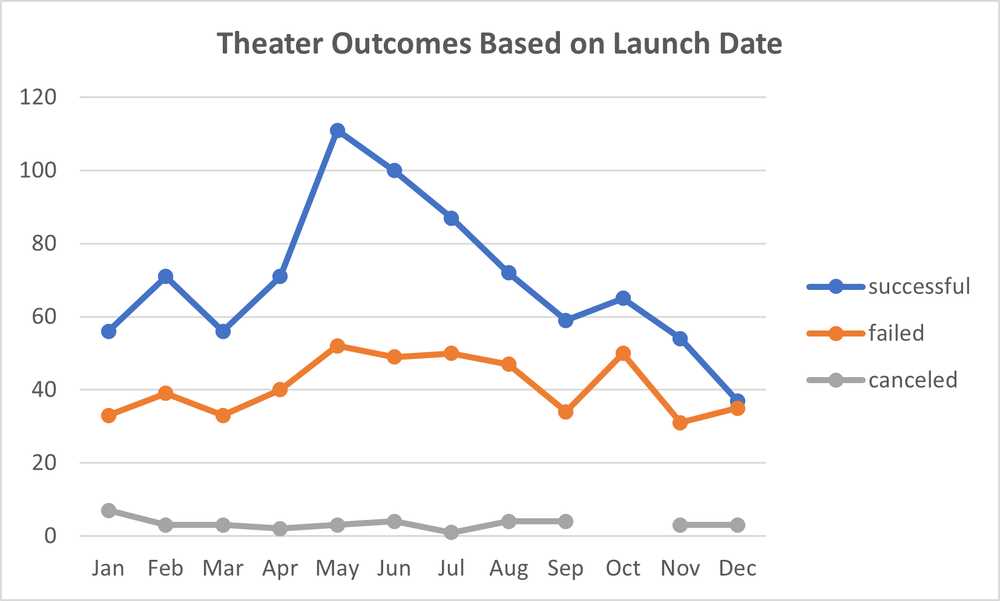

# Kickstarting with Excel

Overview of Project

Louise's play, Fever, almost met its fundraising goal in a short amount of time. Curious to how play campaigns performed in relation to their launch dates
and fundraising goals, I used Excel to show this relationship.

Purpose
The purpose of the project is to find out if there is a relationship between how plays performed and their launch dates and fundraising goals. 

# **Analysis and Challenges**

## Analysis of Outcomes Based on Launch Date

## Analysis of Outcomes Based on Goals

This analysis looks at the the relationship between funding goals and plays' outcomes. I segmented the fundraising goals by $5K increments with $1000 and below as the lowest bound and $50K as the highest bound.

### Challenges and Difficulties Encountered

## **Results**

**Outcomes Based on Launch Date**
1. May through August is the peak season for theater campaign launches with more campaign launches than any other months in the year. 
2. There is an increase in failed theater campaign launches in the month of October, which is curious because October is also when there are no campaign launch cancellations.

**Outcomes Based on Goals**
1. Plays that have a goal of less than $15K or a range between $35k to $45K have a higher success rate than plays outsid that range. 
	-Please note, 92% of the plays had a goal of less than $15K and of those plays, 69% were successful in meeting their goal. 

- What are some limitations of this dataset?

- What are some other possible tables and/or graphs that we could create?

1. I think for outcomes based on launch date, it would be good to look at the 
